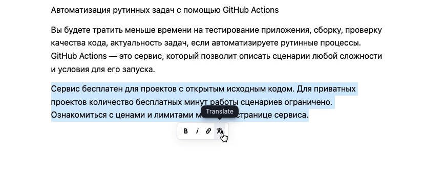

# Translate Inline Tool for Editor.js

This tool allows you to translate text inline to english. 

Requires a translation service. See [Translation Service](#translation-service) for more information.



## Features

Works in any block. just select the text and click the Translate button in the toolbar.

Source language is detected automatically.

Example docker container for the translation service is provided.

`Soon` Choosing the target language to translate.

`Soon` Support for the offical Google Translate API.

## Installation

### Translation Service

This server example uses the [googletrans](https://github.com/ssut/py-googletrans) python package to translate text. Don't use it in production, it's just an example.

Use the [docker-compose.yml](./server/docker-compose.yml) to build and run the translation service.

By default the service runs on port 5000.

CORS are enabled.

### Usage

Use your package manager to install the package `editorjs-translate-inline`.

```
npm install -D @editorjs/translate-inline

yarn add -D @editorjs/translate-inline
```

Import and add the Tool to your Editor.js configuration and provide the endpoint of the translation service.

```
import Translate from '@editorjs/translate-inline';

const editor = new EditorJS({
  tools: {
    translator: {
      class: Translate,
      config: {
        endpoint: 'http://localhost:5000/translate?text=',
      }
    },
  },

  // ...
});
```

## Development

Run translation server:

```
cd server
docker-compose up
```

Run package builder:

`npm run dev` / `yarn dev` — run development environment with hot reload

`npm run build` / `yarn build` — build the tool for production to the `dist` folder

## Links

[Editor.js](https://editorjs.io) • [Create Tool](https://github.com/editor-js/create-tool)